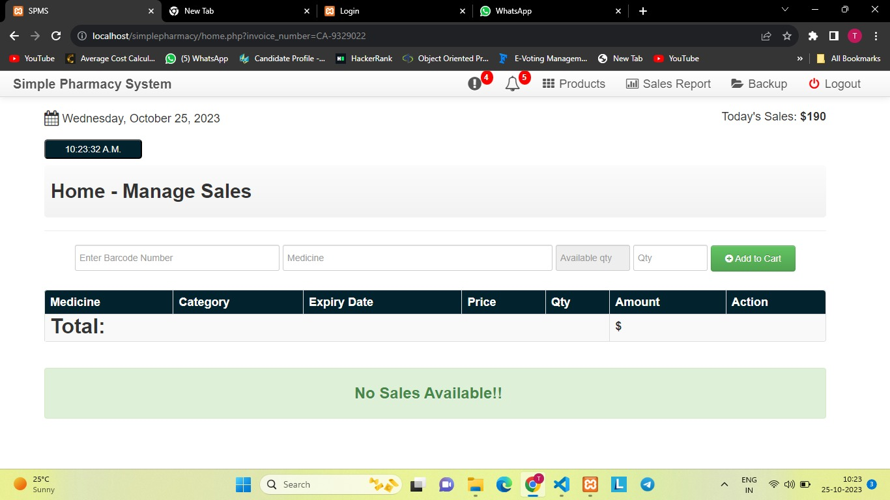
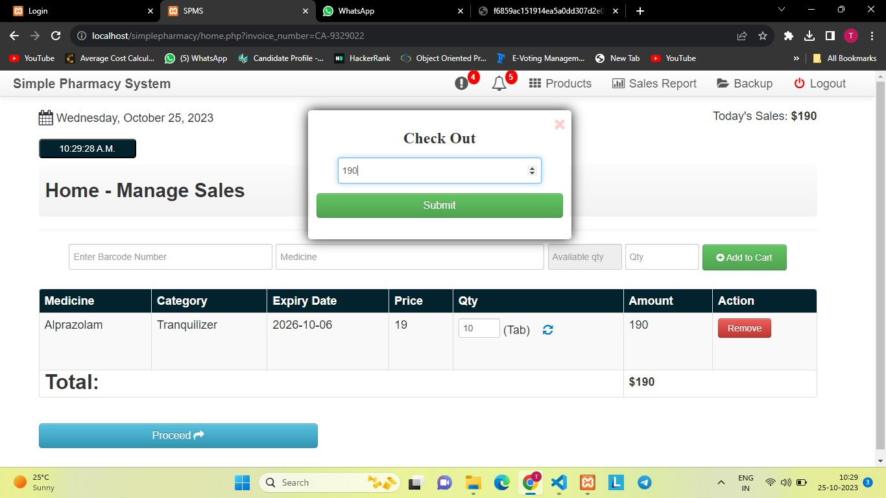
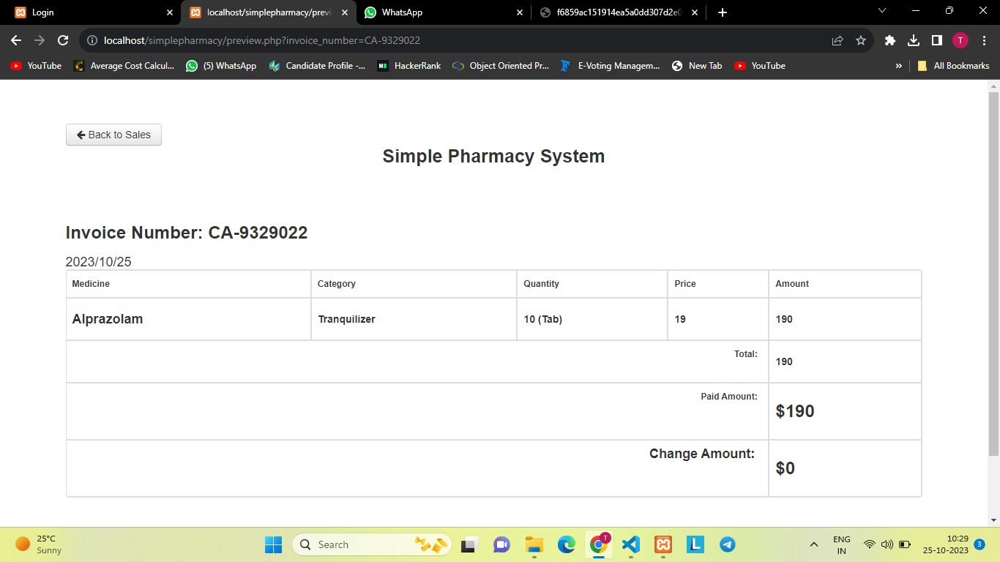
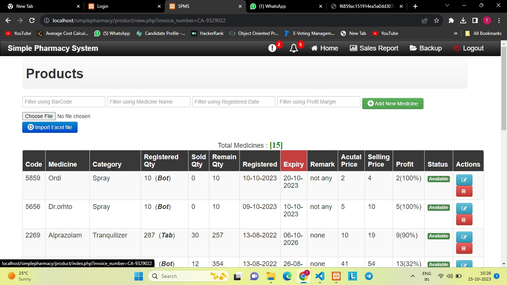
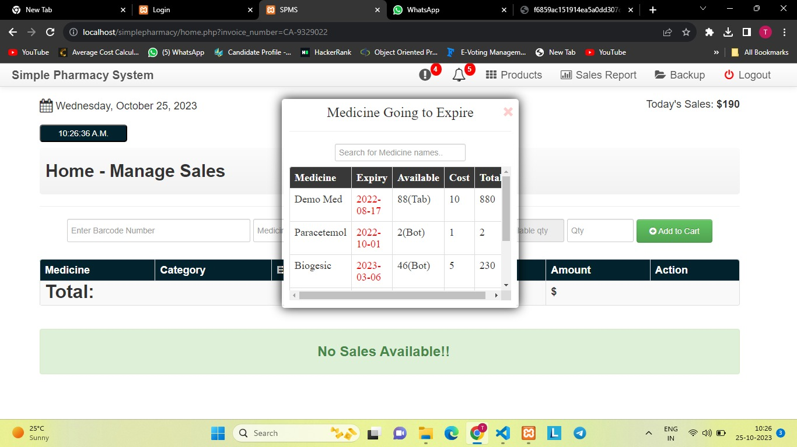

# medi-inventory
Medi Inventory is a pharmacy management system designed to streamline medicine stock tracking, sales, and billing. It helps pharmacies efficiently manage inventory, reduce errors, and improve customer service.

## 📸 Project Screenshots

### 1️⃣ Login  

### 1️⃣ Homepage  

### 1️⃣ Manage Sales  

### 2️⃣ Billing  

### 3️⃣ Inventory Management  

### 3️⃣ Notifications  

