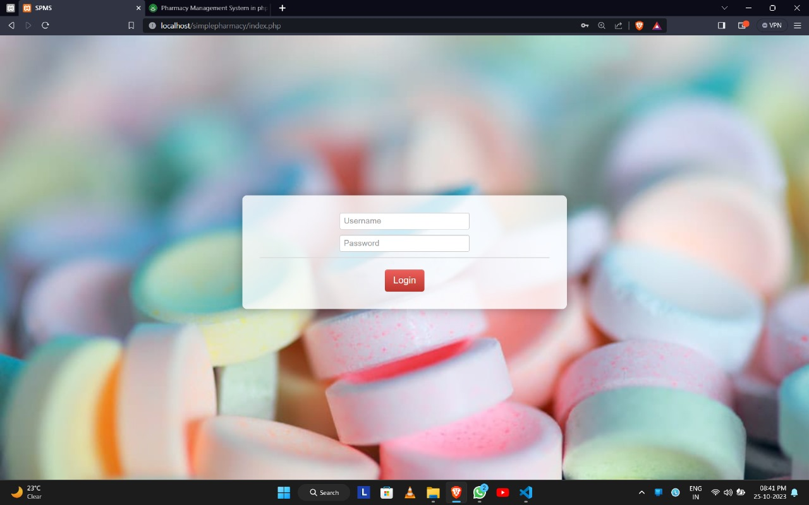

# medi-inventory
Medi Inventory is a pharmacy management system designed to streamline medicine stock tracking, sales, and billing. It helps pharmacies efficiently manage inventory, reduce errors, and improve customer service.

## Features  
✅ **Inventory Management** – Track medicine stock, expiry, and reorders  
✅ **Sales & Billing** – Generate invoices and manage transactions  
✅ **User Management** – Admin and pharmacist roles  
✅ **Reports & Analytics** – Sales and stock analysis  
✅ **Secure Authentication** – Role-based access control 

## 📸 Project Screenshots

### 1️⃣ Login  

### 1️⃣ Homepage  

### 1️⃣ Manage Sales  

### 2️⃣ Billing  

### 3️⃣ Inventory Management  

### 3️⃣ Notifications  

